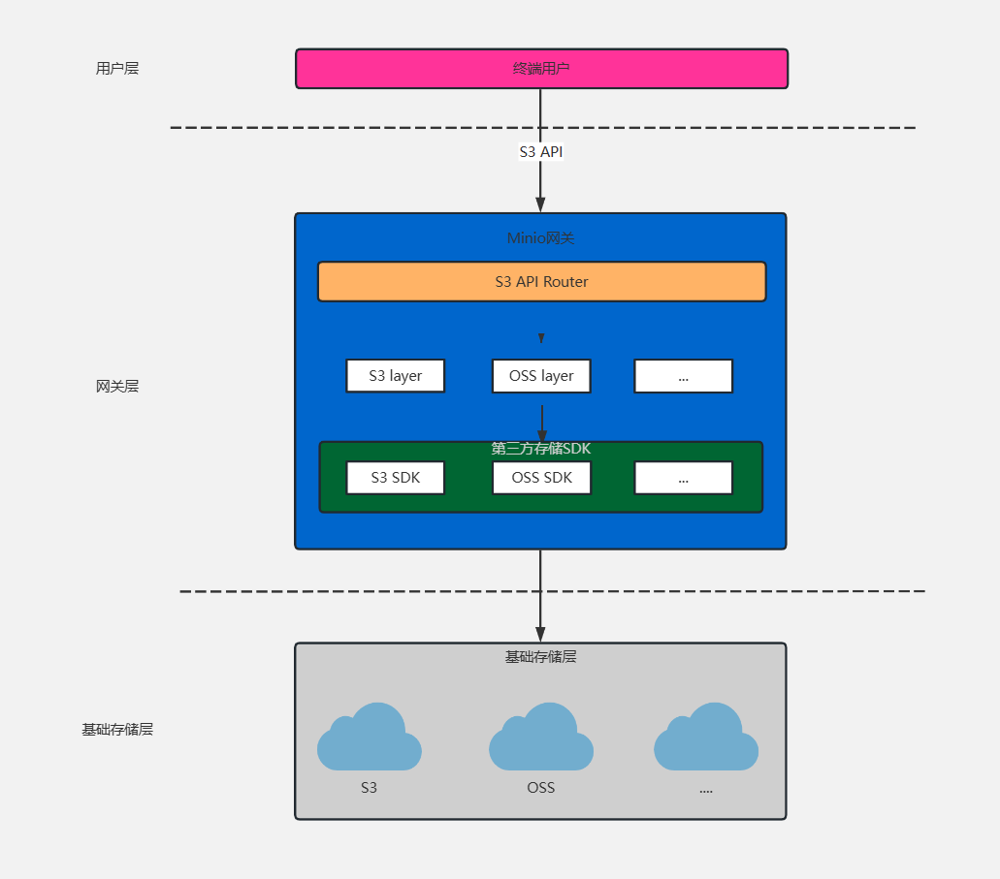

  <h1 align="center">MinIO 分布式对象存储系统</h1>
  

    <a href="README.md"><strong>English</strong></a> | <strong>简体中文</strong>
  

## 目录

- [仓库简介](#项目介绍)
- [前置条件](#前置条件)
- [镜像说明](#镜像说明)
- [获取帮助](#获取帮助)
- [如何贡献](#如何贡献)

## 项目介绍
‌[MinIO‌](https://github.com/minio/minio) MinIO 是一款 高性能、开源、云原生的分布式对象存储系统，兼容 Amazon S3 API，适用于大规模数据存储、备份、分析和 AI/ML 工作负载。它采用 Golang 编写，轻量级且易于部署，适合私有云、公有云和边缘计算环境。

**核心特性：**
1. 高性能对象存储：采用纯软件定义的分布式架构，支持Amazon S3兼容API，提供与AWS S3相同的功能接口（PUT/GET/DELETE等）。通过并行化设计和内存优化，实现高吞吐（单节点可达数GB/s）和低延迟（毫秒级响应），适合大数据、AI/ML等场景。
2. 分布式架构：支持多节点集群部署，默认使用纠删码（Erasure Code）技术，将数据分片存储在不同节点，容忍多磁盘/节点故障（如4节点中允许2节点宕机）。动态扩展能力，可通过简单添加节点实现容量和性能线性增长，支持PB级数据存储。
3. 企业级数据保护：内置加密功能（SSL/TLS传输加密、AES-256服务端加密），支持KMS集成管理密钥。对象锁定（Object Lock）和版本控制（Versioning）功能，防止数据篡改或误删除，满足合规性要求（如SEC 17a-4、HIPAA）。
4. 多云和混合云支持：可部署在物理机、虚拟机、Kubernetes（Operator或Helm Chart）及边缘设备，无缝运行于公有云、私有云或混合云环境。支持存储网关模式，将本地存储作为云存储（如AWS S3）的缓存层。
5. 轻量级与易管理：单一二进制文件部署，无外部依赖，资源占用极低（仅需512MB内存即可启动）。提供Web控制台、命令行工具（mc）及Prometheus/Grafana监控集成，支持日志审计和性能指标可视化。
6. 强一致性模型：所有读写操作严格遵循强一致性，确保数据立即可见且全局一致，避免最终一致性的潜在问题。
7. 丰富的API和生态集成：兼容S3 API，支持所有主流开发语言（Python/Java/Go等）的SDK，无缝对接Hadoop、Spark、Kafka等大数据工具。提供MinIO Select功能，支持直接查询对象内容（如CSV/JSON文件的SQL过滤）。
8. 开源与商业化双许可：开源版本（GNU AGPL v3）包含全部核心功能，企业版扩展了高级特性（如全局缓存、多站点同步）。

本项目提供的开源镜像商品 [**`MinIO-分布式对象存储系统`**](https://marketplace.huaweicloud.com/hidden/contents/be9aa1a6-4d97-445f-8bbe-2e1b1bf3db64#productid=OFFI1138677857956487168)，已预先安装 MinIO 软件及其相关运行环境，并提供部署模板。快来参照使用指南，轻松开启“开箱即用”的高效体验吧。

**架构设计：**

> **系统要求如下：**
> - CPU: 4vCPUs 或更高
> - RAM: 16GB 或更大
> - Disk: 至少 50GB

## 前置条件
[注册华为账号并开通华为云](https://support.huaweicloud.com/usermanual-account/account_id_001.html)

## 镜像说明

| 镜像规格                   | 特性说明 | 备注 |
|------------------------| --- | --- |
| [MinIO20250422221226.0.0-1-arm-v1.0]() | 基于鲲鹏服务器 + Huawei Cloud EulerOS 2.0 64bit 安装部署 |  |

## 获取帮助
- 更多问题可通过 [issue](https://github.com/HuaweiCloudDeveloper/minio-image/issues) 或 华为云云商店指定商品的服务支持 与我们取得联系
- 其他开源镜像可看 [open-source-image-repos](https://github.com/HuaweiCloudDeveloper/open-source-image-repos)

## 如何贡献
- Fork 此存储库并提交合并请求
- 基于您的开源镜像信息同步更新 README.md