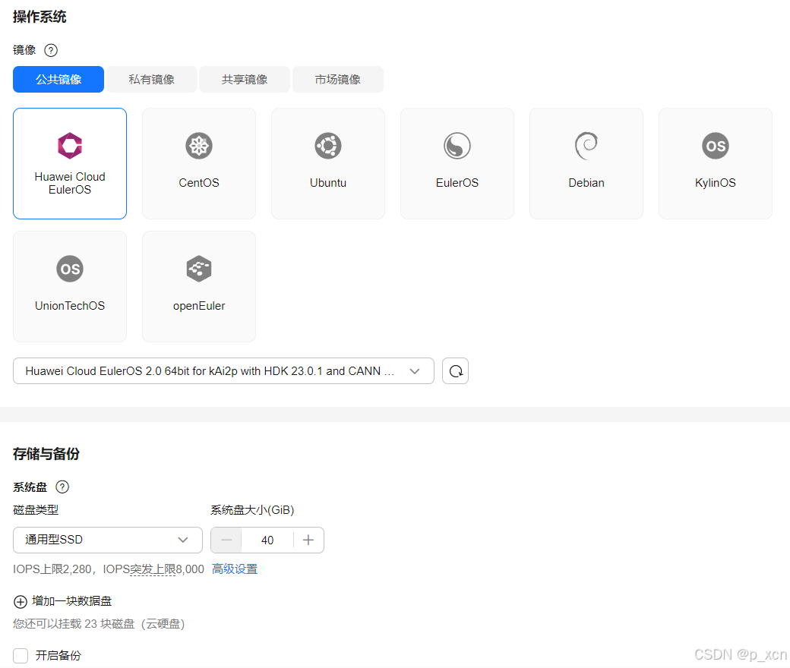
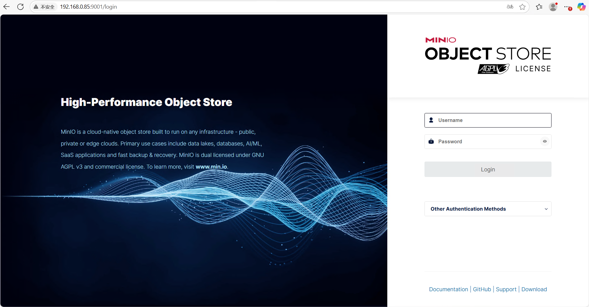
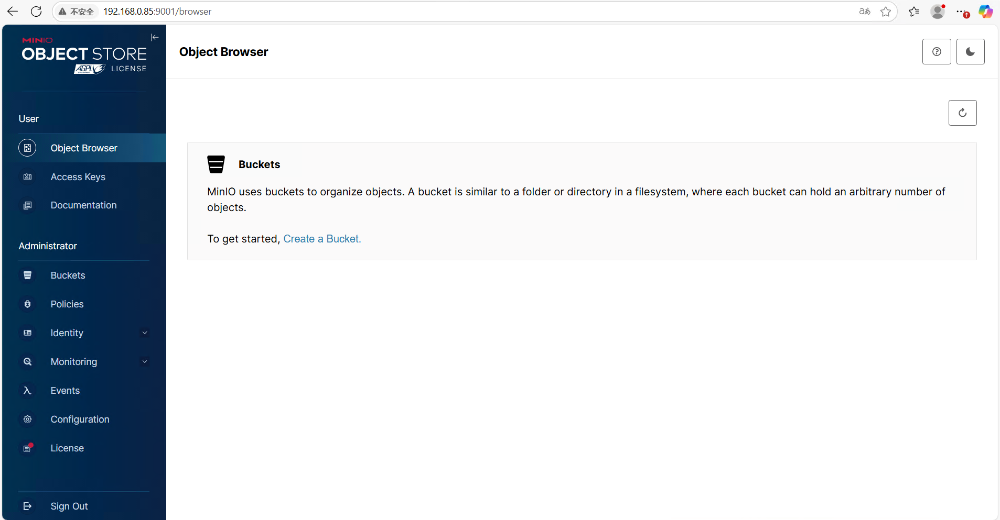

# MinIO 使用指南

# 商品链接

[MinIO-分布式对象存储系统](https://marketplace.huaweicloud.com/hidden/contents/be9aa1a6-4d97-445f-8bbe-2e1b1bf3db64#productid=OFFI1138677857956487168)

# 商品说明

‌TiDB MinIO 是一款 高性能、开源、云原生的分布式对象存储系统，兼容 Amazon S3 API，适用于大规模数据存储、备份、分析和 AI/ML 工作负载。它采用 Golang 编写，轻量级且易于部署，适合私有云、公有云和边缘计算环境。

本商品通过 鲲鹏服务器 + Huawei Cloud EulerOS 2.0 64bit 进行安装部署。

# 商品购买

您可以在云商店搜索 **minio**。

其中，地域、规格、推荐配置使用默认，购买方式根据您的需求选择按需/按月/按年，短期使用推荐按需，长期使用推荐按月/按年，确认配置后点击“立即购买”。

# 商品资源配置

商品支持 **ECS 控制台配置**，下面对资源配置的方式进行介绍。

## ECS 控制台配置

### 准备工作

在使用ECS控制台配置前，需要您提前配置好 **安全组规则**。

> **安全组规则的配置如下：**
> - 入方向规则放通端口 `9001`，**源地址内必须包含您的客户端 ip**，否则无法访问
> - 入方向规则放通 CloudShell 连接实例使用的端口 `22`，以便在控制台登录调试
> - 出方向规则一键放通

### 创建ECS

前提工作准备好后，选择 ECS 控制台配置跳转到购买 ECS 页面，ECS 资源的配置如下图所示：

> **值得注意的是：**
> - VPC 您可以自行创建
> - 安全组选择 [**准备工作**](#准备工作) 中配置的安全组；
> - 弹性公网IP选择现在购买，推荐选择“按流量计费”，带宽大小可设置为5Mbit/s；
> - 高级配置需要在高级选项支持注入自定义数据，所以登录凭证不能选择“密码”，选择创建后设置；
> - 其余默认或按规则填写即可。

# 商品使用

## MinIO 使用

### 控制台访问地址

http://<服务器IP>:9001（默认凭据: myminioadmin / minio-secret-key-change-me）

### 参考文档

[MinIO官网](https://min.io/)